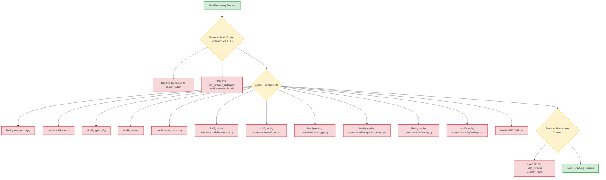

# Project Renaming Plan: RealityRouter
## 1. Directory and File Renames

The following directories and files will be renamed:

*   Rename the top-level directory `llm-router/` to `reality-router/`.
*   Rename the file `llm_rerouter_dist.zip` to `reality_router_dist.zip`.

## 2. File Content Modifications

The following files will have their content updated to replace occurrences of "LLMRerouter", "LLMRouter", "llm-router", "llm_rerouter", etc., with their "RealityRouter" equivalents.

### Global Replacements

*   **"LLMRerouter"** ➡️ **"RealityRerouter"**
*   **"LLMRouter"** ➡️ **"RealityRouter"**
*   **"llm-rerouter"** ➡️ **"reality-rerouter"**
*   **"llm_rerouter"** ➡️ **"reality_router"**
*   **"llm-router"** ➡️ **"reality-router"**
*   **"~/.llm_rerouter"** ➡️ **"~/.reality_router"**
*   **"LLM_REROUTER_HOME"** ➡️ **"REALITY_ROUTER_HOME"**

### Specific File Changes

#### `start_router.py`
*   Update `APP_HOME` environment variable reference and default path:
    ```
    - APP_HOME = os.getenv("LLM_REROUTER_HOME", os.path.expanduser("~/.llm_rerouter"))
    + APP_HOME = os.getenv("REALITY_ROUTER_HOME", os.path.expanduser("~/.reality_router"))
    ```

#### `build_dist.sh`
*   Update the zip file name:
    ```
    - ZIP_NAME="llm_rerouter_dist.zip"
    + ZIP_NAME="reality_router_dist.zip"
    ```

#### `.git/config`
*   Update the remote origin URL:
    ```
    - 	url = http://spark-a0d3.tailcd6737.ts.net:3000/lc/LLMRerouter
    + 	url = http://spark-a0d3.tailcd6737.ts.net:3000/lc/RealityRouter
    ```

#### `start.sh`
*   Update `LLM_REROUTER_HOME` environment variable and its usage:
    ```
    - export LLM_REROUTER_HOME="${LLM_REROUTER_HOME:-$HOME/.llm_rerouter}"
    + export REALITY_ROUTER_HOME="${REALITY_ROUTER_HOME:-$HOME/.reality_router}"
    ```
    *   Update references to `LLM_REROUTER_HOME` in `mkdir -p` and `cp` commands.
    *   Update the launch message:
    ```
    - echo -e "${GREEN}Launching LLM Rerouter Setup Wizard...${NC}"
    + echo -e "${GREEN}Launching Reality Router Setup Wizard...${NC}"
    ```
    *   Update `LOG_DIR` export:
    ```
    - export LOG_DIR="$LLM_REROUTER_HOME/logs"
    + export LOG_DIR="$REALITY_ROUTER_HOME/logs"
    ```

#### `reality-router/event_viewer.py`
*   Update `APP_HOME` environment variable reference and default path:
    ```
    - APP_HOME = os.getenv("LLM_REROUTER_HOME", os.path.expanduser("~/.llm_rerouter"))
    + APP_HOME = os.getenv("REALITY_ROUTER_HOME", os.path.expanduser("~/.reality_router"))
    ```
*   Update `DB_PATH` to reflect new home directory and database name:
    ```
    - DB_PATH = os.path.join(APP_HOME, "llm_router.db")
    + DB_PATH = os.path.join(APP_HOME, "reality_router.db")
    ```

#### `reality-router/src/models/database.py`
*   Update `APP_HOME` environment variable reference and default path:
    ```
    - APP_HOME = os.getenv("LLM_REROUTER_HOME", os.path.expanduser("~/.llm_rerouter"))
    + APP_HOME = os.getenv("REALITY_ROUTER_HOME", os.path.expanduser("~/.reality_router"))
    ```

#### `reality-router/src/router/core.py`
*   Update the API URL:
    ```
    -     "https://llmrerouter-api.jollysand-1b9ed42e.swedencentral.azurecontainerapps.io"
    +     "https://realityrouter-api.jollysand-1b9ed42e.swedencentral.azurecontainerapps.io"
    ```
*   Update "owned_by" and "system_fingerprint" fields:
    ```
    -                 "owned_by": "llm-rerouter",
    +                 "owned_by": "reality-router",
    ```
    ```
    -                 "system_fingerprint": "fp_llm_rerouter",
    +                 "system_fingerprint": "fp_reality_router",
    ```

#### `reality-router/src/utils/logger.py`
*   Update `app_home` environment variable reference and default path:
    ```
    -             app_home = os.getenv("LLM_REROUTER_HOME", os.path.expanduser("~/.llm_rerouter"))
    +             app_home = os.getenv("REALITY_ROUTER_HOME", os.path.expanduser("~/.reality_router"))
    ```

#### `reality-router/src/utils/capability_tester.py`
*   Update `APP_HOME` environment variable reference and default path:
    ```
    - APP_HOME = os.getenv("LLM_REROUTER_HOME", os.path.expanduser("~/.llm_rerouter"))
    + APP_HOME = os.getenv("REALITY_ROUTER_HOME", os.path.expanduser("~/.reality_router"))
    ```

#### `reality-router/src/utils/pricing.py`
*   Update `APP_HOME` environment variable reference and default path:
    ```
    - APP_HOME = os.getenv("LLM_REROUTER_HOME", os.path.expanduser("~/.llm_rerouter"))
    + APP_HOME = os.getenv("REALITY_ROUTER_HOME", os.path.expanduser("~/.reality_router"))
    ```

#### `reality-router/src/config/settings.py`
*   Update `APP_HOME` environment variable reference and default path:
    ```
    - APP_HOME = os.getenv("LLM_REROUTER_HOME", os.path.expanduser("~/.llm_rerouter"))
    + APP_HOME = os.getenv("REALITY_ROUTER_HOME", os.path.expanduser("~/.reality_router"))
    ```

#### `README.md`
*   Update project title:
    ```
    - # LLMRerouter by Confidentia AI and friends powered by Reality Check
    + # RealityRouter by Confidentia AI and friends powered by Reality Check
    ```
*   Update all textual occurrences of "LLMRerouter", "LLMRouter", "llm-router", "llm_rerouter" to "RealityRouter", "reality-router", and "reality_router" respectively.
*   Update the home directory path:
    ```
    - dedicated user home directory: `~/.llm_rerouter/`.
    + dedicated user home directory: `~/.reality_router/`.
    ```
*   Update setup instructions for home directory migration:
    ```
    - to `~/.llm_rerouter/` if found in the project root.
    + to `~/.reality_router/` if found in the project root.
    ```
*   Update strategy names:
    ```
    - **LLM Routing** (Single-shot) or **LLM Rerouting** (Sequential).
    + **Reality Routing** (Single-shot) or **Reality Rerouting** (Sequential).
    ```
*   Update `user_models.json` path:
    ```
    - `~/.llm_rerouter/user_models.json`.
    + `~/.reality_router/user_models.json`.
    ```
*   Update CLI dashboard description:
    ```
    - The LLMRerouter includes a built-in CLI dashboard
    + The RealityRouter includes a built-in CLI dashboard
    ```

### 3. Home Directory Renaming

The user\'s home directory `~/.llm_rerouter` will be renamed to `~/.reality_router` using the following bash command:

```bash
mv ~/.llm_rerouter ~/.reality_router
```

## 4. Renaming project related open tabs

The following open tabs will be renamed:
* `llm-router/package.json` to `reality-router/package.json`
* `plans/llm-router-implementation-plan.md` to `plans/reality-router-implementation-plan.md`
* `plans/llm-router-testing-plan.md` to `plans/reality-router-testing-plan.md`
* `plans/llm-router-final-summary.md` to `plans/reality-router-final-summary.md`
* `plans/llm-router-detailed-implementation-guide.md` to `plans/reality-router-detailed-implementation-guide.md`
* `llm-router/setup.py` to `reality-router/setup.py`
* `llm-router/src/__init__.py` to `reality-router/src/__init__.py`
* `llm-router/src/router/__init__.py` to `reality-router/src/router/__init__.py`
* `llm-router/src/models/__init__.py` to `reality-router/src/models/__init__.py`
* `llm-router/src/models/routing.py` to `reality-router/src/models/routing.py`
* `llm-router/src/utils/__init__.py` to `reality-router/src/utils/__init__.py`
* `llm-router/src/utils/logger.py` to `reality-router/src/utils/logger.py`
* `llm-router/src/adapters/__init__.py` to `reality-router/src/adapters/__init__.py`
* `llm-router/src/adapters/base_adapter.py` to `reality-router/src/adapters/base_adapter.py`
* `llm-router/src/adapters/openai_adapter.py` to `reality-router/src/adapters/openai_adapter.py`
* `llm-router/src/adapters/anthropic_adapter.py` to `reality-router/src/adapters/anthropic_adapter.py`
* `llm-router/src/adapters/cohere_adapter.py` to `reality-router/src/adapters/cohere_adapter.py`
* `llm-router/tests/test_core.py` to `reality-router/tests/test_core.py`
* `llm-router/src/models/database.py` to `reality-router/src/models/database.py`

## Plan Diagram


